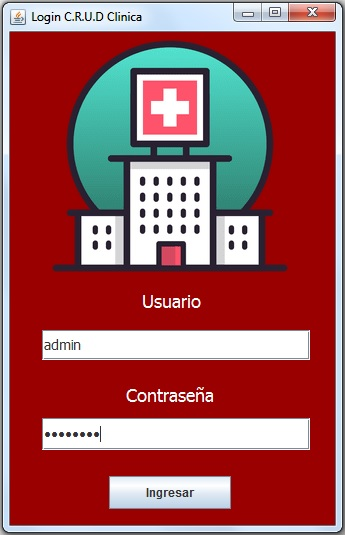
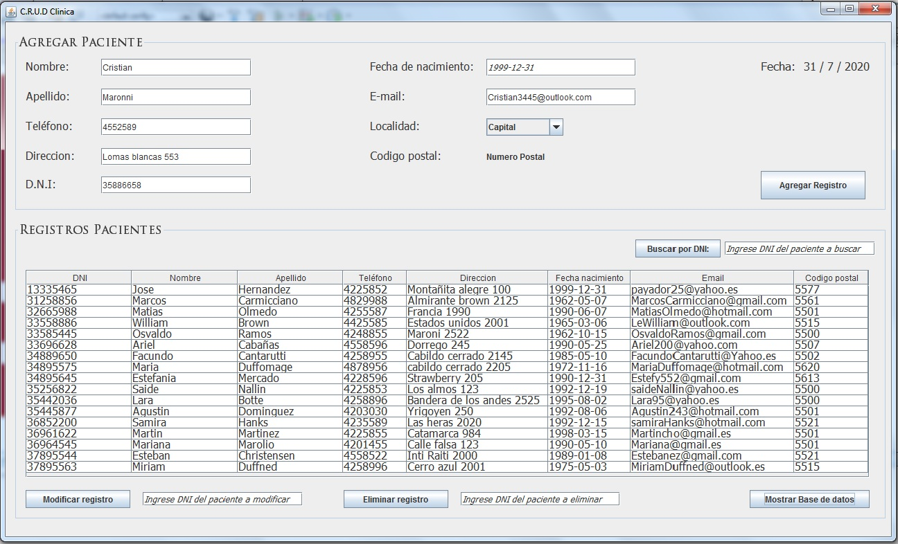
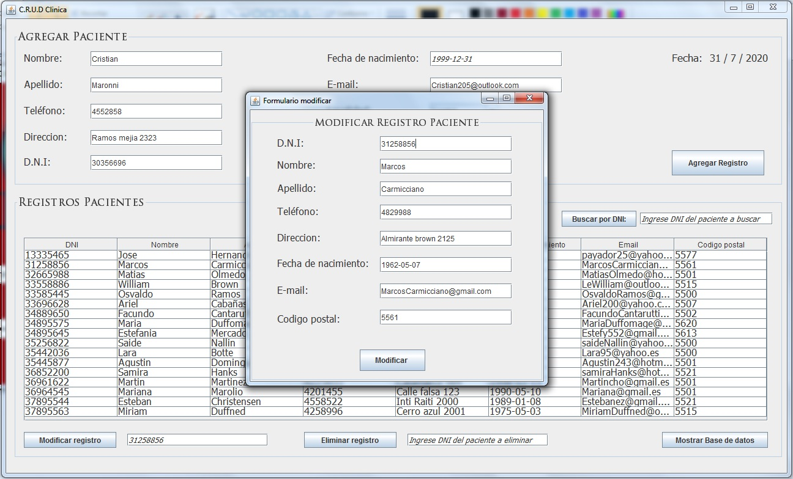

# Sistema-Clinica

Sistema c.r.u.d de clínica desarrollado en NetBeans IDE 8.2, utilizando java, base de datos, tablas relacionales , sqlite3 y la libreria Commons Codec para el cifrado de contraseñas. Usando también la arquitectura modelo, vista , controlador o MVC.
El proyecto consta con un login de inicio de sesión , una ventana principal que nos permite consultar la base de datos asi como también modificar, buscar y eliminar registros.
Se han cargado ya algunos registros para comprobar el correcto funcionamiento del programa (los cuales pueden ser eliminados si lo desean), los datos utilizados no corresponden a personas reales, son solo de prueba.

Para ingresar al traves del login deberá ingresar los siguientes datos:

Usuario: admin

Contraseña: admin123

La ventana principal nos permite tango agregar registros, buscarlos, eliminarlos y modificarlos, todos a traves del DNI del registro.
Para cargar correctamente un registro al utilizar el botón 'Agregar registro' deberá introducir el formato de fecha AAAA-MM-DD o 1999-12-31 , exactamente como sale en el ejemplo utilizando los -

Por ultimo los datos a modificar se presentaran por completo en un sub-formulario lo cual deberá modificar solo lo que quiera cambiar y no modificar aquellos que estén plasmados correctamente a la hora de darle al botón modificar.

El programa  puede ser ejecutado a traves de un IDE, fue probado correctamente en el IDE NetBeans 8.2 e IntelliJ IDEA Community Edition 2020.2.2 o tambien puede probarse traves de su ejecutable en la carpeta dist.

Para poder utilizar el ejecutable es necesario tener instalada la maquina virtual de java, este es el enlace: https://www.java.com/es/download/
